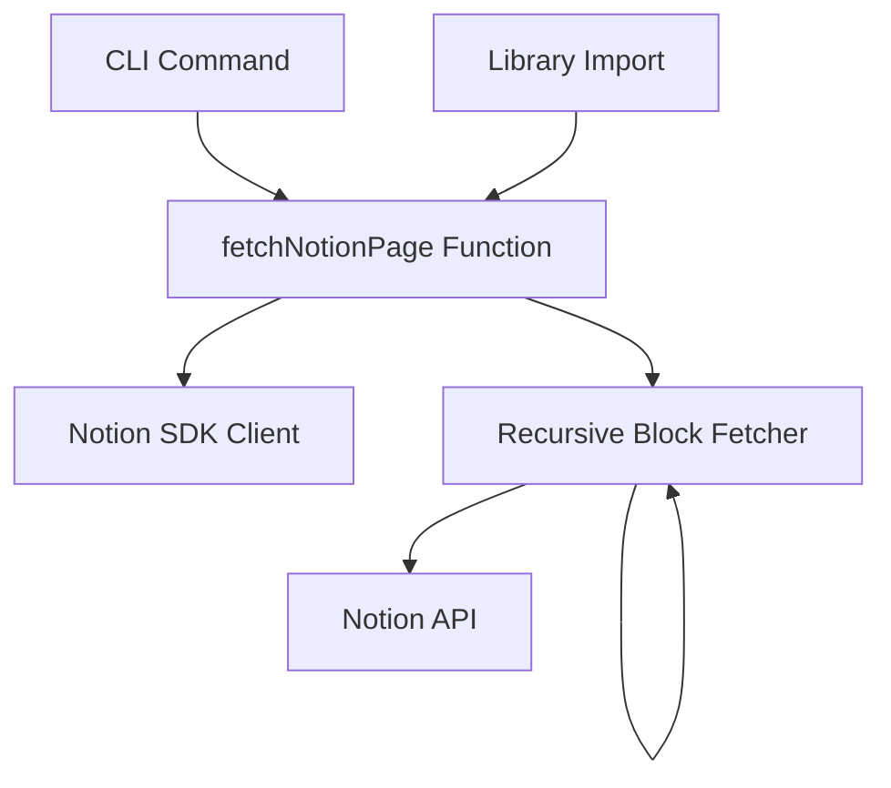

# 設計書

## 概要

NotionページIDを入力として、ページ内の全ブロックを再帰的に取得するツールの設計です。Notion APIの`blocks.children.list`エンドポイントは第一階層のブロックのみを返すため、`has_children`プロパティを利用して再帰的に全階層のブロックを取得します。このツールはTypeScriptライブラリとCLIの両形式で提供されます。

## アーキテクチャ

### システム構成



### レイヤー構成

- **Presentation層** (`src/presentation/`)
  - CLIハンドラー: コマンドライン引数の処理とJSON出力
  
- **Usecase層** (`src/usecase/`)  
  - `fetchNotionPage`: メイン関数、ページIDからブロック階層を取得
  
- **Libs層** (`src/libs/`)
  - `NotionBlockFetcher`: Notion APIとの通信とブロック取得ロジック
  - `RecursiveBlockBuilder`: 再帰的なブロック階層構築

## コンポーネントと インターフェース

### 1. fetchNotionPage関数（メインエクスポート）

```typescript
import { Result } from '@praha/byethrow';
import { BlockObjectResponse } from '@notionhq/client/build/src/api-endpoints';

type FetchNotionPageOptions = {
  apiKey: string;
  maxDepth?: number; // デフォルト: 10
  includePageInfo?: boolean; // デフォルト: false
};

function fetchNotionPage(
  pageId: string,
  options: FetchNotionPageOptions
): Promise<Result.Result<BlockWithChildren[], FetchNotionPageError>>;
```

### 2. CLIハンドラー

```typescript
// src/presentation/cli.ts
type CliOptions = {
  apiKey?: string; // --api-keyオプション、環境変数NOTION_API_KEYから取得可能
};

function runCli(args: string[]): Promise<void>;
```

### 3. ブロック取得サービス

```typescript
// src/libs/notion-block-fetcher.ts
import { Result } from '@praha/byethrow';
import { Client } from '@notionhq/client';

class NotionBlockFetcher {
  constructor(client: Client);
  
  fetchBlocks(blockId: string): Promise<
    Result.Result<BlockObjectResponse[], NotionApiError>
  >;
}
```

### 4. 再帰的ブロック構築

```typescript
// src/libs/recursive-block-builder.ts
import { Result } from '@praha/byethrow';

type BuildBlocksOptions = {
  maxDepth: number;
  currentDepth?: number;
};

async function buildBlockHierarchy(
  blockId: string,
  fetcher: NotionBlockFetcher,
  options: BuildBlocksOptions
): Promise<Result.Result<BlockWithChildren[], BuildError>>;
```

## データモデル

### ブロックデータ構造

```typescript
// Notion API のBlockObjectResponseを拡張
type BlockWithChildren = BlockObjectResponse & {
  children?: BlockWithChildren[];
};
```

### エラー型

```typescript
type FetchNotionPageError =
  | { kind: 'api_key_missing'; message: string }
  | { kind: 'page_not_found'; pageId: string; message: string }
  | { kind: 'unauthorized'; message: string }
  | { kind: 'rate_limited'; message: string }
  | { kind: 'network_error'; message: string; cause?: Error }
  | { kind: 'max_depth_exceeded'; depth: number; message: string }
  | { kind: 'unknown'; message: string; cause?: unknown };
```

## エラーハンドリング

### エラー処理戦略

1. **API認証エラー**: APIキーの検証と明確なエラーメッセージ
2. **ネットワークエラー**: 接続エラーの適切な処理
3. **ページ不存在**: ページIDが無効な場合の処理
4. **再帰深度制限**: 無限ループ防止のための深度チェック
5. **部分的失敗**: 一部のブロック取得に失敗しても可能な限り結果を返す

### エラーレスポンス形式

```typescript
// CLIでのエラー出力
{
  "error": {
    "kind": "page_not_found",
    "pageId": "xxx-xxx-xxx",
    "message": "The specified page was not found or you don't have access to it."
  }
}
```

## テスト戦略

### ユニットテスト

1. **NotionBlockFetcher**
   - APIレスポンスのモック
   - ページネーション処理
   - エラーハンドリング

2. **RecursiveBlockBuilder**
   - 再帰処理のロジック
   - 深度制限の検証
   - has_childrenプロパティの処理

3. **fetchNotionPage**
   - 成功ケースの統合テスト
   - 各種エラーケースの処理

### 統合テスト

1. **CLIテスト**
   - コマンドライン引数の処理
   - 環境変数の読み込み
   - JSON出力の検証

2. **実際のNotion APIとの統合テスト**（オプション）
   - テスト用Notionページの作成
   - 様々なブロックタイプの検証
   - ネストされたブロックの取得確認

### テストデータ

```typescript
// テスト用のモックデータ
const mockPageResponse: BlockObjectResponse[] = [
  {
    object: 'block',
    id: 'block-1',
    type: 'paragraph',
    has_children: false,
    // ... その他のプロパティ
  },
  {
    object: 'block',
    id: 'block-2',
    type: 'toggle',
    has_children: true,
    // ... その他のプロパティ
  }
];
```

## 実装の詳細

### ページネーション処理

Notion APIは最大100件のブロックしか返さないため、`next_cursor`を使用してページネーション処理を実装：

```typescript
import { Result } from '@praha/byethrow';

async function fetchAllBlocks(
  blockId: string
): Promise<Result.Result<BlockObjectResponse[], NotionApiError>> {
  return Result.try({
    try: async () => {
      const blocks: BlockObjectResponse[] = [];
      let cursor: string | undefined;
      
      do {
        const response = await notion.blocks.children.list({
          block_id: blockId,
          start_cursor: cursor,
          page_size: 100,
        });
        
        blocks.push(...response.results);
        cursor = response.next_cursor;
      } while (cursor);
      
      return blocks;
    },
    catch: (error) => ({
      kind: 'api_error' as const,
      message: 'Failed to fetch blocks',
      cause: error,
    }),
  });
}
```

### 再帰処理のフロー

1. ページIDから第一階層のブロックを取得
2. 各ブロックの`has_children`プロパティをチェック
3. `has_children`がtrueの場合、そのブロックIDで再帰的に子ブロックを取得
4. 取得した子ブロックを`children`プロパティに追加
5. 深度制限に達するまで繰り返し

### パフォーマンス最適化

- 並列処理: 複数の子ブロック取得を`Promise.all`で並列実行
- キャッシュ: 同一ブロックの重複取得を避ける（オプション）
- 深度制限: デフォルト10階層までの制限

## セキュリティ考慮事項

1. **APIキーの管理**
   - 環境変数経由での取得を推奨
   - CLIでの直接指定も可能だが、履歴に残らないよう注意喚起

2. **入力検証**
   - ページIDの形式検証
   - 深度制限の妥当性チェック（1-20の範囲）

3. **出力のサニタイズ**
   - JSON出力時の適切なエスケープ処理